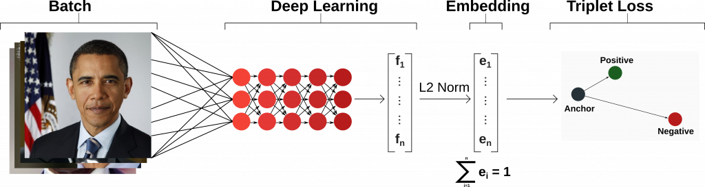
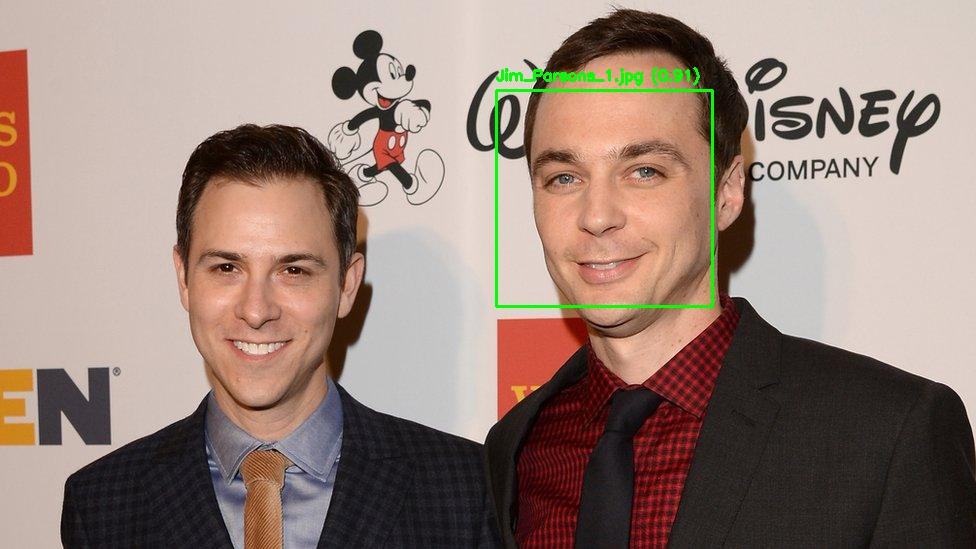

# Simple Face Identification using FaceNet and Similarity Matching


FaceNet is a deep learning model designed for face recognition, verification, and clustering. It works by mapping facial images into a high-dimensional embedding space, where similar faces are placed closer together while different faces are positioned farther apart.



### How FaceNet Works for Identification:
1. **Feature Extraction**: FaceNet processes a facial image through a deep convolutional neural network (CNN) to extract feature representations.
2. **Embedding Representation**: Instead of directly classifying faces, FaceNet generates a 128-dimensional vector (embedding) that uniquely represents the identity.
3. **Triplet Loss Function**: The model is trained using a triplet loss function, ensuring that embeddings of the same person remain closer together while different identities are pushed apart.
4. **Face Matching**:
   - New face embeddings are computed and compared with known embeddings stored in a database.
   - The similarity is calculated using distance metrics such as **cosine similarity** or **Euclidean distance**.
   - If the similarity score is above a predefined threshold, the face is identified as a known individual.
5. **Real-time Recognition**: FaceNet enables real-time face verification by efficiently comparing embeddings instead of performing direct classification.


In this tutorial, we will use **Dlib’s HOG or CNN-based face detector** for detecting faces and **FaceNet with the VGGFace2 backbone** for extracting facial embeddings. The system will:
- Detect faces in an image using **Dlib’s HOG or CNN-based detector**.
- Extract facial embeddings using **FaceNet (VGGFace2 backbone)**.
- Compare detected faces with known identities stored in an ID database.
- Identify and label the detected faces based on similarity scores.

This approach provides a powerful and efficient way to perform face recognition in real-time applications.


## Requirements
### 1. Create and Activate Conda Environment
```sh
conda create -n face_recognition python=3.9 -y
conda activate face_recognition
```
### 2. Install Dependencies
```sh
conda install -c conda-forge opencv numpy scipy nomkl
conda install -c conda-forge dlib cudatoolkit=11.8
pip install torch torchvision torchaudio
pip install facenet-pytorch
```
### 3. Download Face Detection Models
```sh
mkdir -p face_models
curl -L -o face_models/shape_predictor_68_face_landmarks.dat.bz2 http://dlib.net/files/shape_predictor_68_face_landmarks.dat.bz2
curl -L -o face_models/mmod_human_face_detector.dat.bz2 http://dlib.net/files/mmod_human_face_detector.dat.bz2
bzip2 -d face_models/*.bz2
```

## Running the Main Script
Run the following command to execute the main script:
```sh
python main.py
```

## Code Walkthrough
1. **Load FaceNet Model**: Initializes a pre-trained FaceNet model to extract face embeddings.
2. **Load Face Detector**: Uses Dlib's HOG or CNN-based face detector.
3. **Extract Faces** (`extract_faces`): Reads an image, detects faces, and extracts face embeddings.
4. **Load ID Bank** (`load_id_bank`): Loads face embeddings for known individuals from a predefined folder.
5. **Compare Faces** (`match_faces`): Matches detected faces with known identities using cosine similarity.
6. **Display Results**: Draws bounding boxes and labels on detected faces, displaying the results in a window.

## Results

For this example we will use Jim Parsons as the known identity. Accordingly, we expect the system will detect and identify which face in the image belongs to Jim Parsons!




Hope you enjoyed this tutorial! Happy coding! 🚀

